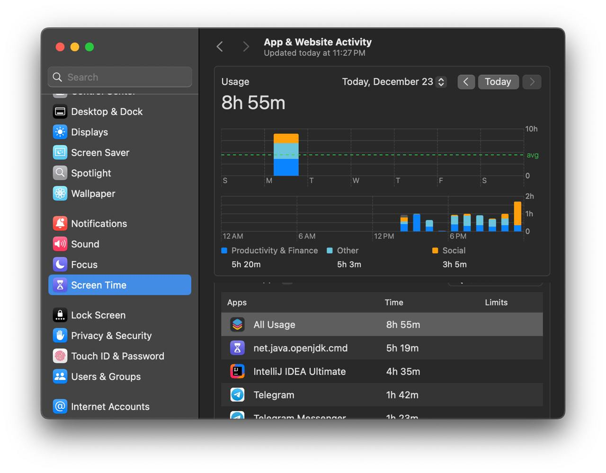

<div align="center">
  
  <br>
  
  
  
</div>

# Introduction

Minecraft Protocol is a project I developed because all existing libraries for packet handling are either outdated or
insufficiently lightweight for use in my projects (also due to a complete rewrite of the [Abelix](https://abelix.team)
codebase).

The project was written in a single attempt by one person, so there might be bugs or less-than-perfect code. I would
greatly appreciate any pull requests or issues.



# Project Overview

## Purpose

This project is designed for the most convenient and integrable development of systems that require the use of Minecraft
protocol packets (e.g., fake entities, nametags for servers, proxy systems).

## Key Objectives

* Simplify packet handling and monitoring as much as possible.
* Ensure integration with all modern server cores and standalone applications.

#

# Usage Guide

## Maven / Gradle library adding

1. Add a repository:

Maven:

```xml
<repositories>
    <repository>
        <id>milansky-repo</id>
        <url>https://maven.milansky.ovh/releases</url>
    </repository>
</repositories>
```

Gradle:

```groovy
repositories {
    maven {
        url = "https://maven.milansky.ovh/releases"
    }
}
```

2. Add dependencies

Maven:

```xml
<properties>
    <protocol.version>1.1.1</protocol.version>
</properties>

<dependencies>
    <dependency>
        <groupId>by.milansky.protocol</groupId>
        <artifactId>api</artifactId>
        <version>${protocol.version}</version>
    </dependency>
    <dependency>
        <groupId>by.milansky.protocol</groupId>
        <artifactId>base</artifactId>
        <version>${protocol.version}</version>
    </dependency>
    <dependency>
        <groupId>by.milansky.protocol</groupId>
        <artifactId>vanilla-protocol</artifactId>
        <version>${protocol.version}</version>
    </dependency>
    
    <!-- Add bukkit if you need it -->
    <dependency>
        <groupId>by.milansky.protocol</groupId>
        <artifactId>bukkit</artifactId>
        <version>${protocol.version}</version>
    </dependency>
</dependencies>
```

Gradle:

```groovy
dependencies {
    // It's better to use gradle's dependencyResolutionManagement
    def protocolVersion = '1.1.1'
    
    compileOnly "by.milansky.protocol:api:${protocolVersion}"
    compileOnly "by.milansky.protocol:base:${protocolVersion}"
    compileOnly "by.milansky.protocol:vanilla-protocol:${protocolVersion}"
    
    // Add bukkit if you need it
    compileOnly "by.milansky.protocol:bukkit:${protocolVersion}"
}
```

## Java API usage

More detailed usage examples can be found in the [examples](examples) directory. However, to briefly explain, here's how
you can listen to all `ClientboundTeam` packets:

1. Create a handler to process packets:

```java
@Log4j2
public final class ClientboundTeamHandler {
    @PacketProcessor
    public @NotNull PacketHandleResult handle(final Channel channel, final ClientboundTeam team) {
        // Log that the server is attempting to send a packet
        log.info("Outbound team packet: {}", team);

        if (team.containsPlayer("milanskyy")) {
            // Prevent the packet from being sent
            return BasePacketHandleResult.cancel();
        }

        // Everything is fine; allow the packet to be sent
        return BasePacketHandleResult.ok();
    }
}
```

2. Add the handler on player join:

```java
public final class NametagListener implements Listener {
    @EventHandler
    public void onCreate(final ProtocolPlayerCreateEvent event) {
        val protocolPlayer = event.protocolPlayer();

        // Since this handler is annotation-based, wrap it in an AnnotationBasedHandler
        // and add it to the player
        protocolPlayer.appendPacketHandler(AnnotationBasedHandler.create(ClientboundTeamHandler.create()));
    }
}
```

# Credits

Special thanks for ideas and inspiration to these projects:

* [Velocity](https://github.com/PaperMC/Velocity), [BungeeCord](https://github.com/SpigotMC/BungeeCord) - for some ideas
  and packet structures.
* [BridgeNet](https://github.com/MikhailSterkhov/bridgenet) - for the idea of this beautiful readme